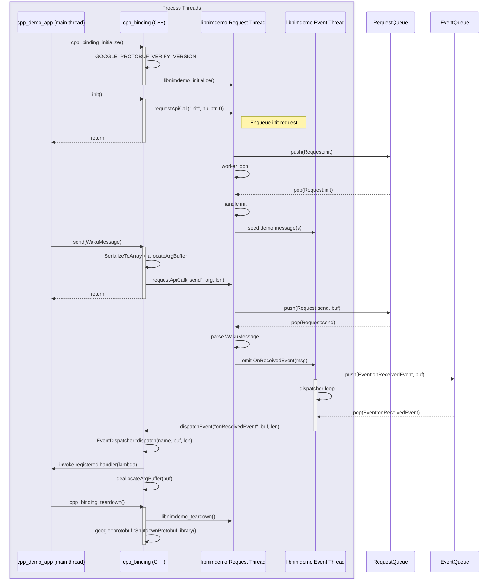

# libnimdemo / cpp_binding / cpp_demo_app – Sequence Diagram

```mermaid
sequenceDiagram
    %% Participants
    box rgba(200,200,255,0.2) Process Threads
    participant CPP as cpp_demo_app (main thread)
    participant CppBind as cpp_binding (C++)
    participant NimReq as libnimdemo Request Thread
    participant NimEvt as libnimdemo Event Thread
    end
    participant Qreq as RequestQueue
    participant Qevt as EventQueue

    %% Startup
    CPP->>CppBind: cpp_binding_initialize()
    activate CppBind
    CppBind->>CppBind: GOOGLE_PROTOBUF_VERIFY_VERSION
    CppBind->>NimReq: libnimdemo_initialize()
    deactivate CppBind

    %% App init call
    CPP->>CppBind: init()
    activate CppBind
    CppBind->>NimReq: requestApiCall("init", nullptr, 0)
    Note right of NimReq: Enqueue init request
    CppBind-->>CPP: return
    deactivate CppBind
    NimReq->>Qreq: push(Request:init)

    %% Request processing loop
    activate NimReq
    NimReq->>NimReq: worker loop
    Qreq-->>NimReq: pop(Request:init)
    NimReq->>NimReq: handle init
    NimReq->>NimEvt: seed demo message(s)

    %% Send message from app
    CPP->>CppBind: send(WakuMessage)
    activate CppBind
    CppBind->>CppBind: SerializeToArray + allocateArgBuffer
    CppBind->>NimReq: requestApiCall("send", arg, len)
    CppBind-->>CPP: return
    deactivate CppBind
    NimReq->>Qreq: push(Request:send, buf)

    %% Request:send processing
    Qreq-->>NimReq: pop(Request:send)
    NimReq->>NimReq: parse WakuMessage
    NimReq->>NimEvt: emit OnReceivedEvent(msg)

    %% Event dispatching
    NimEvt->>Qevt: push(Event:onReceivedEvent, buf)
    activate NimEvt
    NimEvt->>NimEvt: dispatcher loop
    Qevt-->>NimEvt: pop(Event:onReceivedEvent)
    NimEvt->>CppBind: dispatchEvent("onReceivedEvent", buf, len)
    deactivate NimEvt

    %% Callback invocation on app thread
    CppBind->>CppBind: EventDispatcher::dispatch(name, buf, len)
    CppBind->>CPP: invoke registered handler(lambda)
    CppBind->>CppBind: deallocateArgBuffer(buf)

    %% Teardown
    CPP->>CppBind: cpp_binding_teardown()
    activate CppBind
    CppBind->>NimReq: libnimdemo_teardown()
    CppBind->>CppBind: google::protobuf::ShutdownProtobufLibrary()
    deactivate CppBind
```
